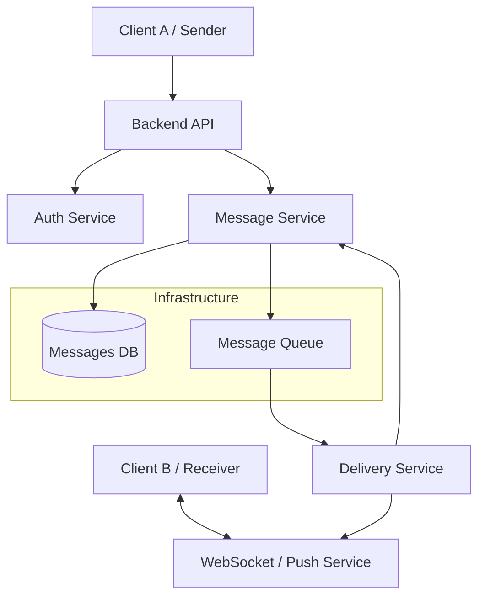
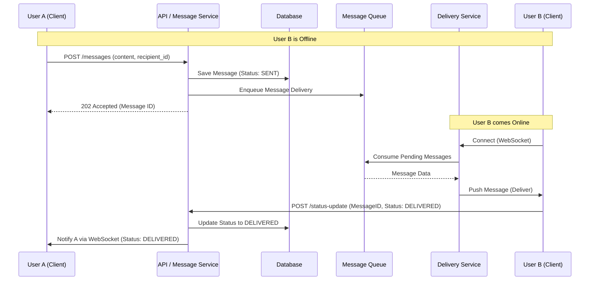
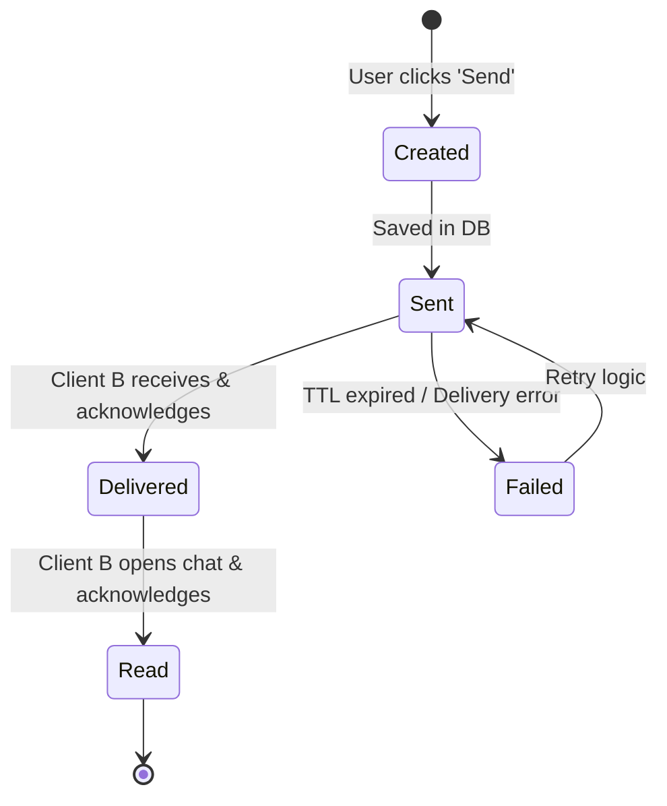

Laboratory Work 1: Designing a Messaging System
Variant: 2 — Message Status Tracking

Part 1 — Component Diagram

Responsibilities:
Client: Надсилання повідомлень та відправка підтверджень (Acknowledgements) про отримання/прочитання.

Backend API: Валідація запитів, аутентифікація та проксіювання до бізнес-логіки.

Message Service: Збереження повідомлень у БД та управління станами (sent, delivered, read).

Message Queue: Асинхронний буфер для гарантованої доставки повідомлень.

Delivery Service: Відстежує наявність користувача в мережі та передає дані через WebSocket або Push-сповіщення.

Part 2 — Sequence Diagram

Part 3 — State Diagram

Key Logic:
Sent: Повідомлення успішно збережене в системі.

Delivered: Клієнтський додаток отримувача отримав пакет даних і автоматично надіслав ack.

Read: Користувач-отримувач відкрив вікно чату (trigger event), що ініціює фінальне оновлення статусу.

Part 4 — ADR (Architecture Decision Record)

# ADR-002: Client-Side Acknowledgement for Status Updates
Status: Accepted

Context:
У системі з обміном повідомленнями критично важливо точно знати, чи дійшло повідомлення до пристрою (Delivered) та чи побачив його користувач (Read). Мережеві з'єднання можуть бути нестабільними, тому сервер не може вважати повідомлення "доставленим" просто за фактом відправки в сокет.

Decision:
Ми впроваджуємо систему підтверджень на рівні клієнта (Application-level ACKs).

Статус Delivered встановлюється лише тоді, коли пристрій отримувача надсилає сигнал підтвердження після успішного отримання даних.

Статус Read ініціюється виключно дією користувача (відкриття чату) на фронтенді.

Alternatives:

Server-side Assumption (Rejected): Вважати доставленим, як тільки дані пішли в TCP-канал. Ризиковано, бо додаток на девайсі міг "впасти" до того, як зберіг повідомлення.

Polling (Rejected): Клієнт постійно запитує нові повідомлення. Це занадто навантажує батарею мобільних пристроїв та сервер.

Consequences:

+ Accuracy: Точне відображення стану повідомлення для відправника.

+ Reliability: Можливість реалізувати повторну відправку (Retry), якщо ack не отримано протягом певного часу.

- Traffic: Невелике збільшення кількості запитів до API за рахунок окремих запитів на зміну статусу.
